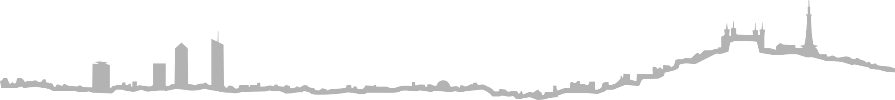

<h3 align="center">
    <a href='https://monsieur-biche.fr' title='Cliquez pour accéder au site internet de Monsieur Biche'>
        🦌 Monsieur Biche 🦌
    </a>
</h3>

<!--
Accompagnement sur mesure
Direction Technique as a Service
CTO as a Service
Construire des relations de confiance
Selon vos besoins, à votre rythme
-->

    

<!--
Architecture
Conception
Développement
Maquettes
UX/UI
Proof of Concept
Gestion de projet
Assistance à Maîtrise d'Ouvrage
Recrutement
Infrastructure
DevOps
Cybersécurité
-->

<!-- English version -->

    <a href='https://github.com/MonsieurBiche/.github/blob/main/profile/README.en-US.md' title='Display this page in English'>
        <!--  -->
        
        <!--  -->
    </a>

    

<!-- Social & useful links -->

    <!-- LinkedIn -->
    
    <!-- Website -->
    
    <!-- Contact -->
    

##  Introduction 🤝 <small>_« Salut, ça biche ? »_</small>
<!-- Notre version à nous du « Salut, ça farte ? » de Brice de Nice (2005) -->

🏆 **Les clés de la réussite** ? Selon nous, ce sont la **flexibilité et la réactivité** !

🌱 Nous vous proposons un **accompagnement sur mesure dans la réalisation de vos projets**, qu'ils viennent de germer dans votre esprit ou qu'ils mûrissent depuis des années. 

🧑‍🤝‍🧑Monsieur Biche, c'est **la puissance d'une communauté d'experts pluridisciplinaire** pour répondre aux problématiques des startups et entreprises innovantes.

💪 Notre projet, c'est avant tout de mettre **des entrepreneurs au service d'autres entrepreneurs**, afin de **partager et construire ensemble**. Nous proposons d'ailleurs à la communauté Monsieur Biche des outils facilitant le travail au quotidien, ainsi que des évènements exclusifs !

##  Nos objectifs 🕵️ <small>_« Votre mission, si toutefois vous l'acceptez... »_</small>
<!-- Mission Impossible (1996-2024) -->

    

##  Nous rejoindre 🪳 <small>_« Would you like to know more ? »_</small> 
<!-- Starship Troopers (1997) -->

🌍 **Visitez notre [site internet](https://monsieur-biche.fr/)** pour en savoir plus sur nous  
  
☎️ Vous y trouverez également **tous [les moyens de nous contacter](https://monsieur-biche.fr/join-us)**  

<!-- 

    <source media="(prefers-color-scheme: dark)" srcset="/images/skyline-lyon-france-white.svg">
    <source media="(prefers-color-scheme: light)" srcset="/images/skyline-lyon-france-black.svg">
    
 -->

    <picture>
        <!-- INFO @see https://github.com/stefanjudis/github-light-dark-image-example -->
        <!-- WARNING @see https://github.com/github/markup/issues/1583 -->
        <source media="(prefers-color-scheme: dark)" srcset="/images/skyline-lyon-france-white.svg">
        <source media="(prefers-color-scheme: light)" srcset="/images/skyline-lyon-france-black.svg">
        
    </picture>
    <picture>
        <!-- INFO @see https://github.com/stefanjudis/github-light-dark-image-example -->
        <!-- WARNING @see https://github.com/github/markup/issues/1583 -->
        <source media="(prefers-color-scheme: dark)" srcset="../images/skyline-lyon-france-white.svg">
        <source media="(prefers-color-scheme: light)" srcset="../images/skyline-lyon-france-black.svg">
        
    </picture>

    <small>
        <a href='https://www.youtube.com/watch?v=t9XRnbuOyHc'>🏐🦌</a>
        <!-- RRRrrr (2003) -->
    </small>

<!-- EOF -->
